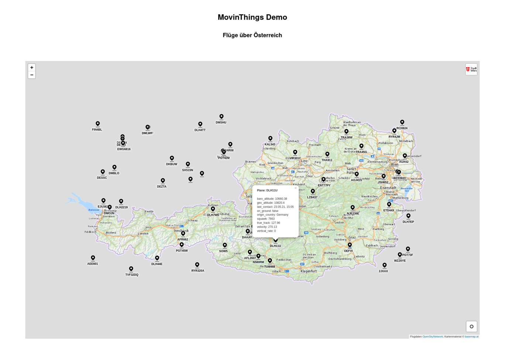

# MovinThings

## Introduction

This is MovinThings, a __visualization web component__ for
__things moving in geo-space__, in other words: a map with
moving dots and more. Data comes from a __configurable,
generic backend__, normally polling a [FIWARE Orion Context
Broker](https://fiware-orion.readthedocs.io/en/master/).
Other data sources can be adapted to.

Here's the screenshot of a demo:



## Purpose

MovinThings provides a generic visualization component for
the [FIWARE Orion Context
Broker](https://fiware-orion.readthedocs.io/en/master/).
Find out more about FIWARE on the [FIWARE Home
Page](https://www.fiware.org/).

MovinThings is released under the [EUPL
1.2](https://joinup.ec.europa.eu/collection/eupl/eupl-text-eupl-12).

## Contributors

MovinThings is developed in a collaboration between PACE,
the innovation team of the [City of Vienna,
Austria](https://www.wien.gv.at/) and
[Profirator](https://profirator.fi).

## How to read the docs

The documentation is formatted with
[MkDocs](https://www.mkdocs.org). The Markdown sources are
in [docs/docs](./docs/docs).

If MkDocs is installed, the following commands serve the
documentation:

```
cd docs
mkdocs serve
```

If [Docker](https://www.docker.com/) is installed, MkDocs
can also be run from a Docker image:

```
cd docs
docker run --rm -v "`pwd`:/app" -w /app -p 8000:8000 minidocks/mkdocs serve -a 0.0.0.0:8000
```

If [Docker Compose](https://docs.docker.com/compose/) is installed,
one of the supplied compose files can be used. 

Vienna and Profirator use very different environments and
setups. First, please clone the project. Then, if you are

* Vienna: execute [build/init_dev_env_vienna.sh](./build/init_dev_env_vienna.sh)
* Profirator: execute [build/init_dev_env_profirator.sh](./build/init_dev_env_profirator.sh)
* Anyone else: execute [build/init_docs_only.sh](build/init_docs_only.sh)

After the setup has been executed once, `docker-compose.yml`
will be a symbolic link to the chosen configuration.

As the name implies,
[build/init_docs_only.sh](build/init_docs_only.sh)
configures a single service, serving the documentation. The
configurations for Vienna and Profirator each start a
backend and a demo page with the component, utilizing the
backend. Both configurations need a running [FIWARE Orion
Context
Broker](https://fiware-orion.readthedocs.io/en/master/) with
a certain unique configuration. Therefore, the supplied
backend and demo configurations only work for the
contributors. Please read the docs for how to create your
own configuration.

At this point, the project can be started, running 

```
docker-compose up --build
```

Once app runs, documentation is served under
[localhost:8000](http://localhost:8000).

Finally, if nothing else works, you can always look at the
markdown files in [docs/docs](docs/docs).
