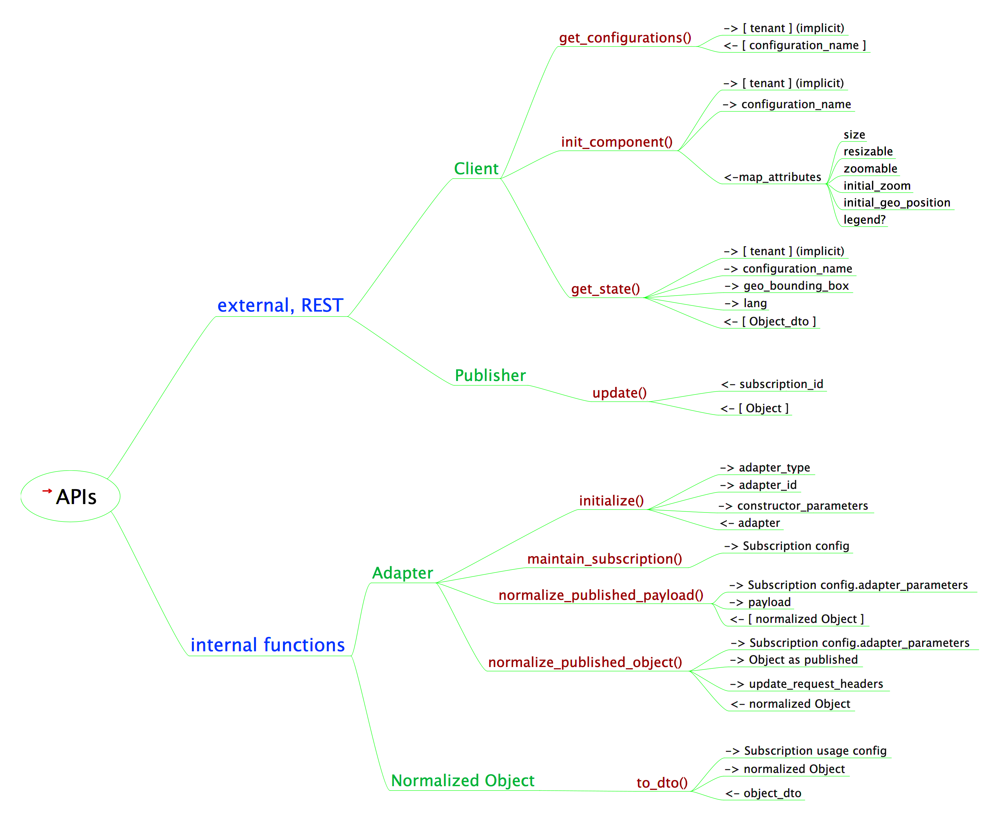
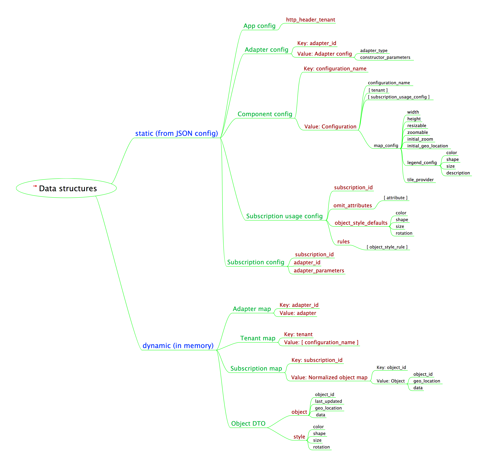
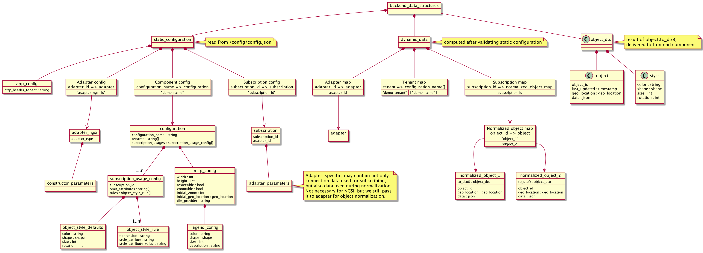

# Backend

!!! note 
    The backend has its [own repo](https://bitbucket.org/ma14pace/movin-things-backend)

!!! note
    Diagrams can be clicked and open in a new tab

## API

The backend is a REST service. The following mind map gives
an overview of the API:

{: target="_blank"}

See [Backend Behaviour](backend_behaviour.md) for detailed
description of the API.

## Data Structures

The backend is designed to have two types of data
structures.See [Backend Design
Decisions](backend_overview.md) for a list of design
decisions, that lead to these structures.

* __Static configuration__ is stored in an external JSON file. 
  The backend validates the file on loading.
  
* __Dynamic Data__ is either derived from static configuration
  (e.g. a few reverse lookup tables), or it is current object
  state, collected in the backend, pulled by clients.

Here's a mind map of the data structures:

{: target="_blank"}

## Object diagram

{: target="_blank"}

