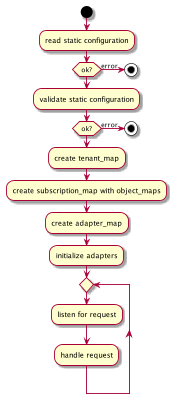
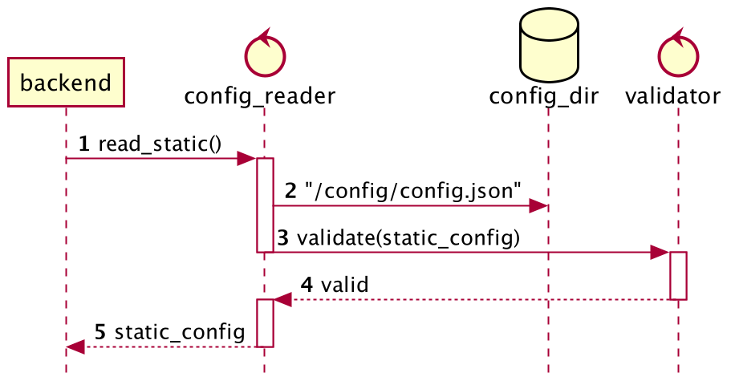
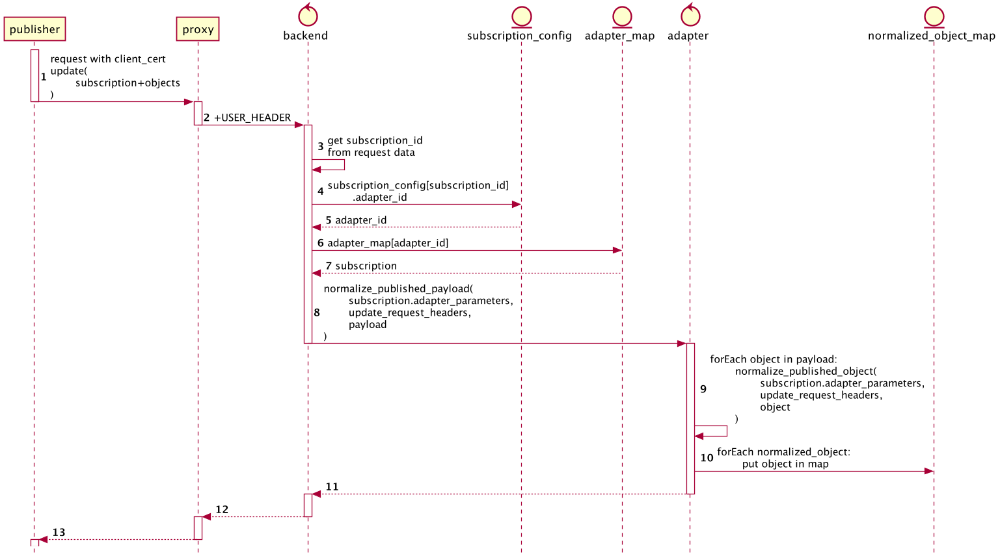
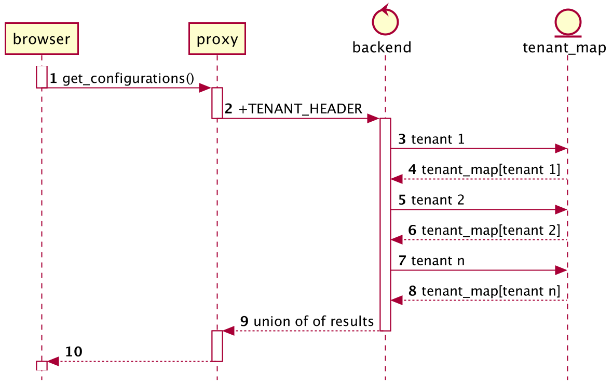
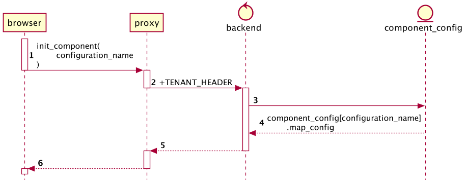
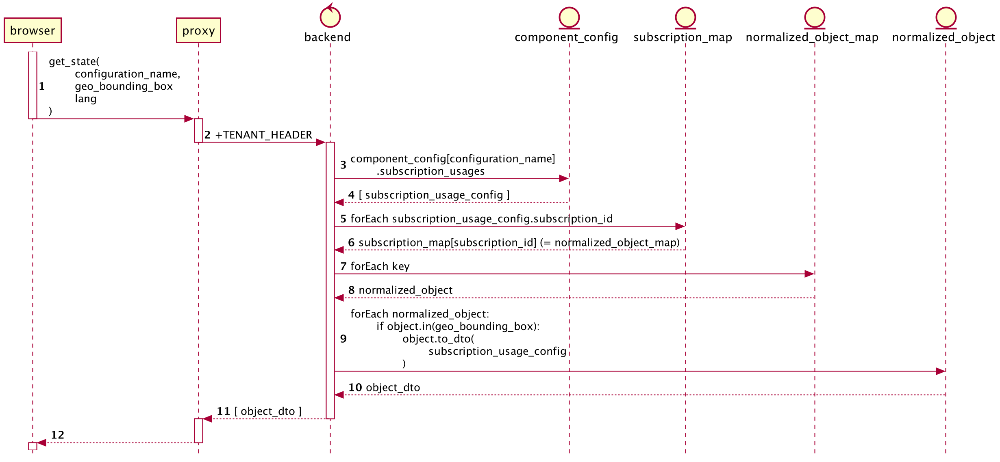

# Backend Behaviour

!!! note
    Diagrams can be clicked and open in a new tab

## Introduction

The backend is a stand-alone __docker-compose__ application.
It has one container. Configuration is mapped into the
container as files under `/config`. If secrets are needed,
they will be mapped as files into `/secrets`.

In its first iteration, the backend will be implemented as a
__monolith__. __Adapters__ for different data sources will
be built into it as libraries. __No plugin concept__ is
implemented, all code is built into the image and is
directly called as functions

## Configuration

One or more config files will be detailed here

## Startup

1. Start up and read JSON configuration file(s)
1. Validate static config
1. Build a __tenant map__ from component configs
1. For each subscription configured in any configuration, create a normalized object map and store it in the subscription map
1. Create adapters from __adapter config__
1. Let adapters __maintain__ their configured __subscriptions__

{: target="_blank"}

Static configuration is read from a directory mapped into the container

{: target="_blank"}

## Publisher REST API

### update()
  
Gets called by subscribed publishers upon any change.
Objects published must

* have an ID that is unique across all data sources
* carry geo-coordinates

{: target="_blank"}

A non-empty array of objects is expected, along with the
subscription ID, altogether in one JSON. This condition is
satisfied for FIWARE NGISv2. In case of other adapters, it
would have to be provided.

Once the object arrives as published, the corresponding
adapter is looked up. It is called with
`normalize_publish_payload()`, which isolates the objects
and then, for each object, calls
`normalize_published_object()`. The resulting normalized
object is then put into the subscription map's __normalized
object map__

Thus we have offloaded most of the data source-specific work
to the adapter. There's one problem though:

In step 3, we need to extract the subscription ID from a
data source-specific payload. We can't use the adapter to 
do this, because the subscription ID is necessary to 
find the proper adapter. Therefore, this code must be
changed with every adapter.

Another option to find the adapter, would be to use 
kind of a fingerprinting algorithm on the payload.

As for NGSI, we can just check for the key `subscriptionId`
in the payload. Ideally we would model other data source
adapters in the same way.

Another thing to mention is, that we pass
`adapter_parameters` and `update_request_headers` to the
adapter. Neither are necessary for NGSI, but it won't hurt
to pass them, as other adapters might use them.

## Client REST API

### GET api/v1/get_configurations

A list of tenants the client belongs to (1+) is implicitly
provided in HTTP headers.

{: target="_blank"}

Steps performed:

1. For all of the client's tenants, a list of
   `configuration_name` exists in tenant map. Return the union
   of these lists.

### GET api/v1/init_component

A list of tenants the client belongs to (1+) is implicitly
provided in HTTP headers.

Parameters: 

* `configuration_name`

{: target="_blank"}

The web component is configured with a `configuration_name`,
either statically or dynamically with one of the tenants
returned from `get_configurations()`.
  
Steps performed:

1. Verify that `component_name` is in tenant map for one of 
   client's tenants, fail if not
1. Return map attributes from named configuration

### GET api/v1/get_state

A list of tenants the client belongs to (1+) is implicitly
provided in HTTP headers. 

Parameters:

* `configuration_name`
* `geo_bounding_box` is a pair of geo-coordinates spanning a 
  rectangle. It designates the current view on the map. Only 
  objects within that recatangle are delivered.
* `lang`, as supplied to the component. This can be used by the 
  backend to create __ObjectDTOs__ with dates and timestamps
  in the data properly formatted and in sync with the language 
  of the embedding page.
  
!!! note
    In a first step, the lang parameter is ignored by the backend

{: target="_blank"}

Steps performed:

1. Verify that component_name is in tenant map for one of 
   client's tenants, fail if not
1. Create empty result list
1. Get list of `subscription_usage_config` from configuration map
1. For each `subscription_usage_config`, lookup normalized object 
   map in subscription map
1. For all normalized objects in map: 
   if `object.in(geo_bounding_box)`, convert object to __ObjectDTO__, 
   and add that to result

Convert object to ObjectDTO by omitting attributes,
combining with style defaults from subscription_config and
applying object style rules

The result contains an entry for each observed object, but
with full data only for those objects, that have changed
after the last visit.
